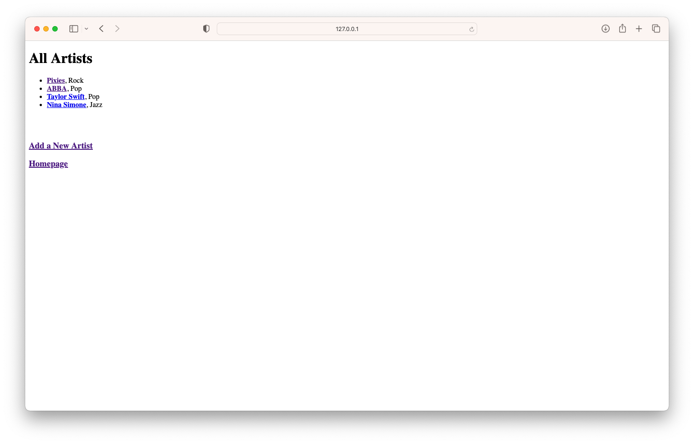
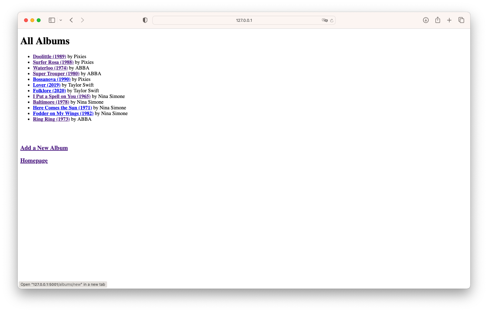
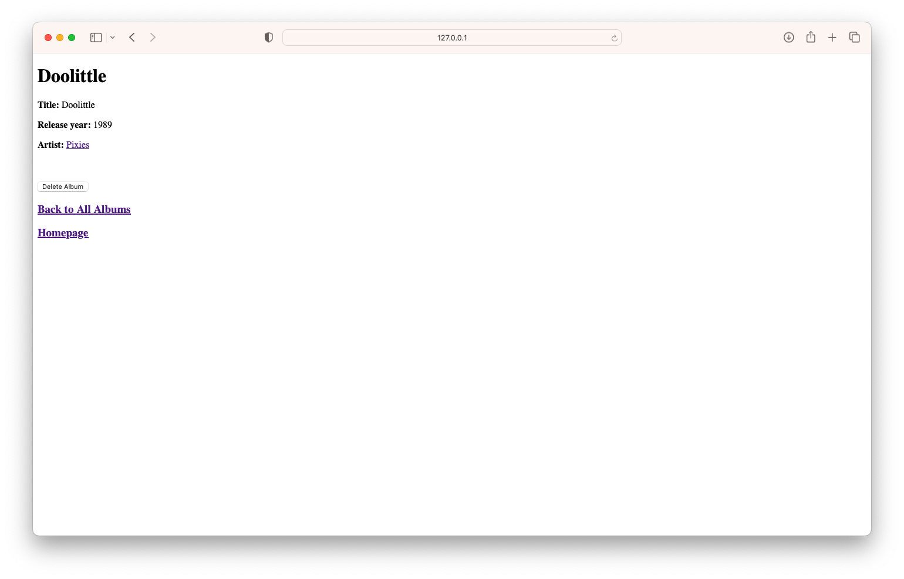
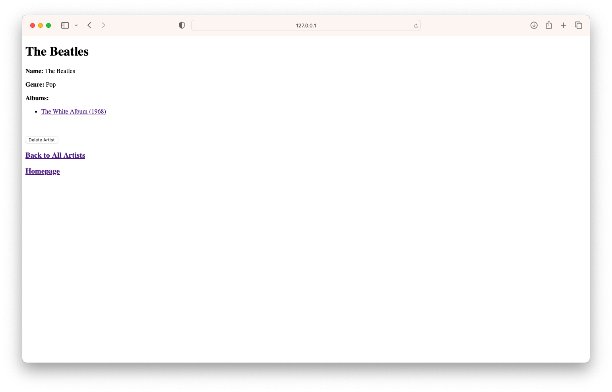

# Music Library HTML Project

This is a simple CRUD project with Python and HTML aiming to demonstrate the following:

* TTD and OOP with Python and HTML
* CRUD operations on a database using PostgresQL
* HTTP Protocol
* Flask and Jinja

All artist and album names are linked to their respective pages wherever they show up for easy navigation across the site. Album creation is restricted to albums associated with existing artists in the database.

## Screenshots

### Homepage

### Artists (all and single artist)

### Albums (all and single album)

### Creating a New Artist and Adding Albums

